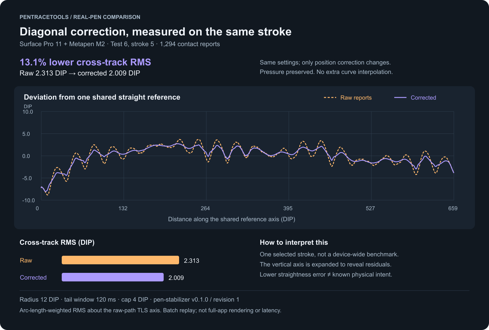
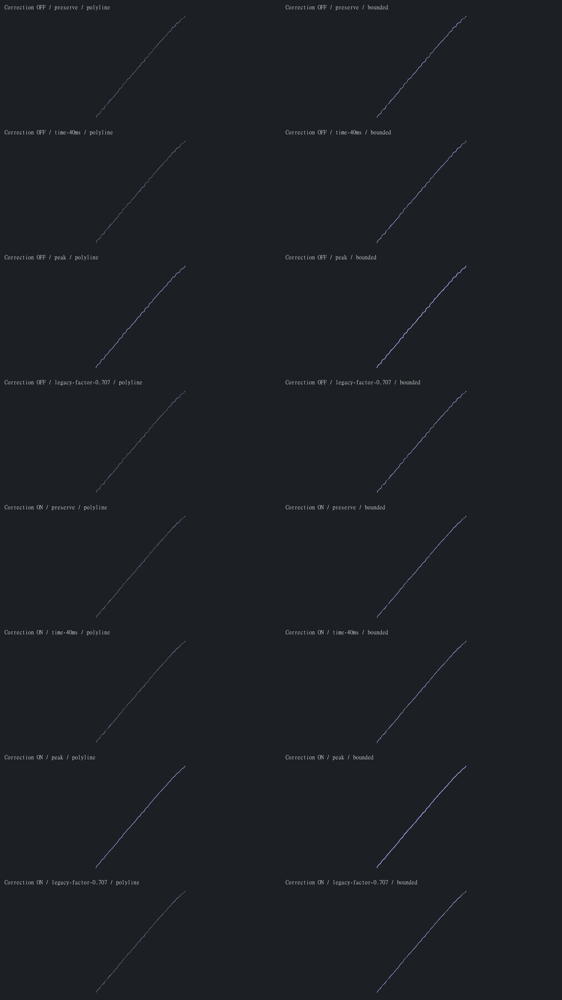
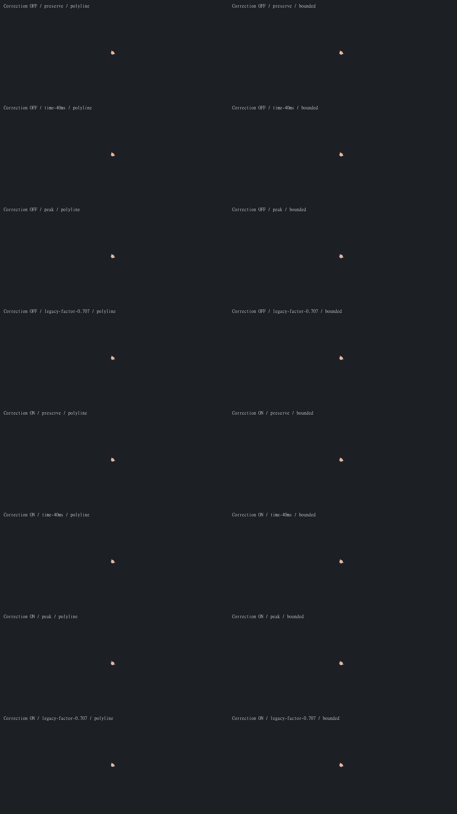
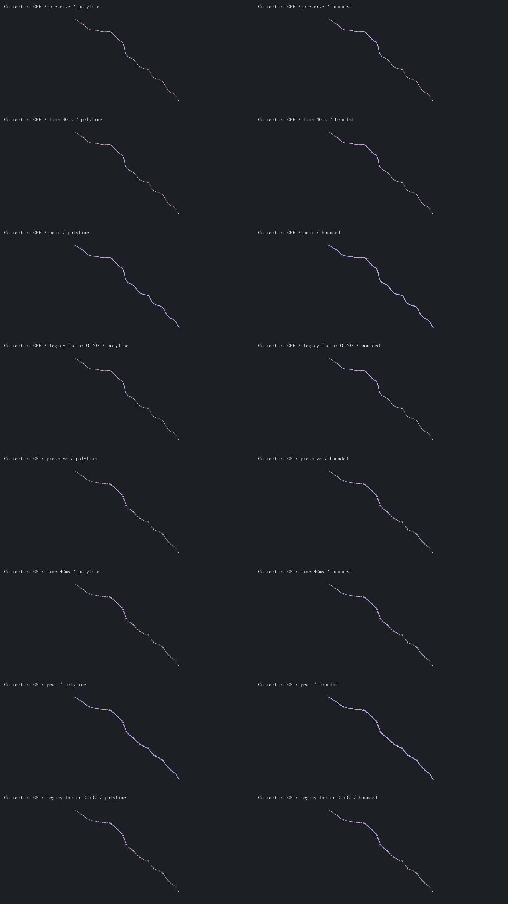

# Real-pen Test 6: same-input pipeline comparisons

These are selected strokes drawn by the tester on a **Surface Pro 11 with a Metapen M2**.
They are real recorded pen reports, not synthetic perfect lines. Published with the tester's
permission. The complete recording, device identifiers, timestamps, logs and vertex CSVs
are not included. This small selected set is illustrative, not a representative benchmark.

## Open the comparisons

The orange trace contains the original recorded positions; purple is the corrected
centerline. The expanded vertical scale makes small ripples visible. This is a
position-only comparison: both paths preserve pressure and use polyline rendering.

PNG previews are checked into this repository for convenient GitHub viewing. The original,
unchanged, zoomable SVGs are attached to the [comparison archive](https://github.com/PenTraceTools/pen-trace-lab/releases/tag/comparison-test6-2026-09-13).
That archive contains **comparison images, not raw recordings or an application release**.

| Recorded stroke (zero-based) | Contact samples | Preview | Original SVG |
| --- | ---: | --- | --- |
| 0 | 22 | [PNG](stroke-0.png) | [Download](https://github.com/PenTraceTools/pen-trace-lab/releases/download/comparison-test6-2026-09-13/stroke-0.svg) |
| 5 | 1,294 | [PNG](stroke-5.png) | [Download](https://github.com/PenTraceTools/pen-trace-lab/releases/download/comparison-test6-2026-09-13/stroke-5.svg) |
| 10 | 382 | [PNG](stroke-10.png) | [Download](https://github.com/PenTraceTools/pen-trace-lab/releases/download/comparison-test6-2026-09-13/stroke-10.svg) |

Stroke 5: diagonal comparison, 16 variants

Stroke 0: short stroke, 16 variants

Stroke 10: additional stroke, 16 variants

## How to read each image

- Orange dashed: original measured centerline. Purple: diagnostic variable-width output.
- Top four rows: position correction Off. Bottom four: On.
- Within each group: preserve pressure, time-domain width decay (40 ms), whole-stroke peak,
  and legacy per-report width propagation (factor 0.707), in that order.
- Left column: polyline. Right: bounded curves, maximum 0.25 DIP from sample chords.
- All 16 panels use the **same input samples and plot scale within that stroke**.
  Different strokes are fitted independently: their displayed scale is not directly comparable.
- Brush preset: 15 DIP, minimum relative width 0. Position settings: 12 DIP neighborhood
  radius, 120 ms live-tail revision window, 4 DIP displacement cap.
- None of these selected strokes needed missing-pressure or receipt-clock fallbacks.

## What this does and does not establish

On the displayed diagonal, correction reduces visible small ripples but does not remove
all waviness. Polyline/bounded differences are subtle at the overview scale. Width changes
can conceal or emphasize waviness; a thicker stroke is not evidence of more accurate geometry.
Stroke 10 also shows flattening of some curved/wavy sections. Without an intended-path
reference, that cannot be classified as either successful noise removal or preserved detail.
The short stroke 0 is included as a short-contact example, not a useful diagonal benchmark.

The position core here uses its **batch replay interface**. InfiniPaint's interactive integration
uses streaming append. These final previews do not measure live-tail changes, input-to-photon
latency, or subjective drawing feel.

The replay uses InfiniPaint's actual pressure and curve helpers, but approximates variable
width with opaque round-capped segments. It does **not** reproduce original brush-size spacing,
midpoint/tip editing, complete Skia outlines/antialiasing, document simplification or exports.
In particular, **Correction Off is a raw sample-pipeline baseline, not a full upstream-renderer
screenshot**. The legacy pressure row does not simulate the complete original engine.

Windows reports are not physical ground truth. There is no measured intended path, speed
classification or percentage physical-accuracy improvement assigned to these examples. Do not infer
that every bend is sensor wobble, or generalize these three selected strokes to other hardware.

## Reproducible provenance

- Replay source: [InfiniPaint 3d5262308345cab1b1b7dfcc45207a1f98e9a67f](https://github.com/alexiokay/infinipaint-Custom/blob/3d5262308345cab1b1b7dfcc45207a1f98e9a67f/tools/pen_replay.cpp).
- Recording parser/core: [PenTraceLab e13be1ccf06039c46ae9997beb8810fc28bf5929](https://github.com/PenTraceTools/pen-trace-lab/tree/e13be1ccf06039c46ae9997beb8810fc28bf5929).
- Position library: **v0.1.0, algorithm revision 1**, [adbdce4e902433fcd14fba16e08863f2ec909f79](https://github.com/PenTraceTools/pen-stabilizer/tree/adbdce4e902433fcd14fba16e08863f2ec909f79).
- Replayed locally with the CI-built ARM64 utility; no new local C++ build was performed.
- The private recording contains 34 strokes; the table identifies the selected indices.
- [SVG SHA-256 checksums](SHA256SUMS.txt). The three grid PNGs are rasterizations of the unchanged SVGs.
- The new `diagonal-analysis.png` chart uses stroke 5's replayed centerlines, not pixels
  traced from the preview image. Its source recording and vertex CSV remain private.

Reproduction requires the original recording, deliberately not published here. For your own
recordings, see the [replay instructions](https://github.com/alexiokay/infinipaint-Custom/blob/graphite-ui/docs/BRUSH_PIPELINE.md#replay-comparisons-on-the-build-pc).

## Measurement method: the diagonal chart

Stroke 5 has 1,294 contact reports and 1,292 accepted centerline vertices in each
variant after coincident-point merging. The chart compares correction Off/On with
preserved pressure and polyline rendering, holding all other parameters fixed.

One total-least-squares (PCA) reference line is fitted to the **continuous raw
polyline**, weighted by segment length. Its origin is the arc-length-weighted
centroid and its direction is the dominant covariance eigenvector. That same line
is used for both variants; the corrected path is not independently refitted.

For signed perpendicular residuals `r0, r1` at a segment's endpoints and segment
length `L`, its exact squared-error integral is `L * (r0*r0 + r0*r1 + r1*r1) / 3`.
RMS is the square root of the sum of these integrals divided by total path length.
Each variant is integrated along its own continuous polyline. This avoids bias from
uneven report density. A separate numerical midpoint integration (100 subdivisions
per segment) agrees within 0.00001 DIP; endpoints are unchanged.

| Whole-stroke measurement | Original | Corrected |
| --- | ---: | ---: |
| Cross-track RMS (DIP) | 2.312743 | 2.008780 |
| Maximum absolute residual (DIP) | 8.833127 | 8.042951 |
| Polyline arc length (DIP) | 683.448314 | 665.328527 |

Relative RMS reduction is `100 * (1 - correctedRMS / rawRMS)` = **13.142955%**.
This includes broad bowing and endpoint deviation as well as small ripples. It is
**not an isolated wobble-frequency metric**, an intent-preservation score, or an
average over the recording. The plot's horizontal coordinate is projection along
the shared line; its vertical coordinate is the signed residual, in DIP.

## Next comparison charts

Keep **position, pressure and rendering** separate when evaluating improvements:

1. For explicitly straight-line trials, compare raw and corrected signed cross-track residuals
   against one shared reference axis (guide or a raw-path fit). Plot residual versus arc length,
   then report RMS, P95 and maximum in DIP. A fitted axis measures straightness, not true intent.
2. Separate slow/normal/fast trials using valid report timing, with duration and timing coverage.
   Measured speed itself contains position noise; it is not an independent motion reference.
3. Pair straightness results with displacement, corner/curve detail, endpoints and deliberate
   small-wave tests. Straightening everything must not score as a universal success.
4. Evaluate the causal streaming output separately: tail revisions, frozen prefix, correction
   caps, long-stroke processing time and frame costs. Measure input-to-photon latency separately.
5. Use repeated strokes in both diagonal directions, horizontal/vertical controls, and multiple
   screen locations. Freeze parameters before evaluating a held-out set; report all trials,
   sample counts and spread rather than selecting the best-looking examples.

The chart above supplies a first whole-stroke straightness measurement. Repeated,
speed-labelled trials and an independent intended-path reference are still needed
before making broader quality claims.

## Upstream review scope

Related: [position-correction PR #98](https://github.com/ErrorAtLine0/infinipaint/pull/98)
and [pipeline discussion #99](https://github.com/ErrorAtLine0/infinipaint/issues/99).
The broader pressure/renderer experiment is fork-only. These images are supplementary
evidence, **not full-app validation of those PRs or an upstream endorsement**.
